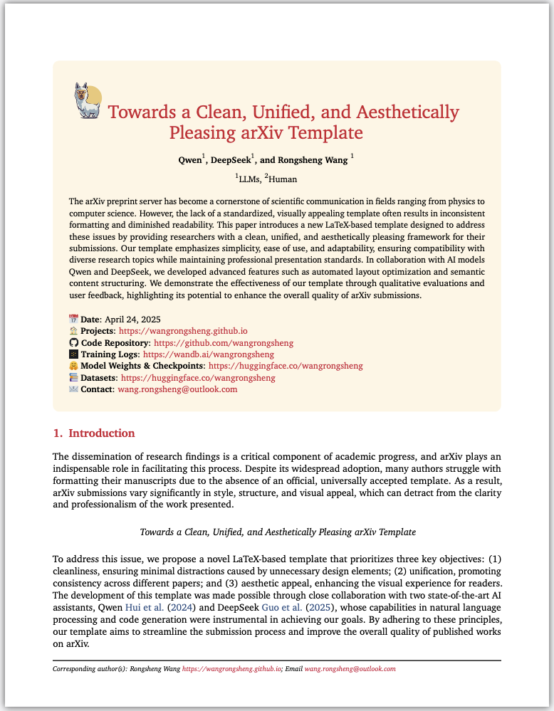
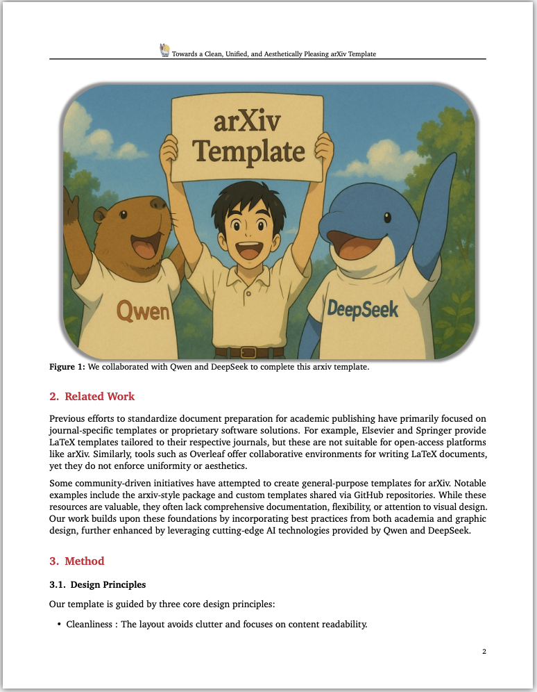

# Rongsheng Wang's Arxiv Template

This is **a Clean, Unified, and Aesthetically Pleasing arXiv Template**, created by Rongsheng Wang. Wishing you a pleasant experience using it!

#### Preview

<table>
    <tr>
        <td></td>
        <td></td>
    </tr>
</table>

#### Usage

1. Download
```bash
git clone https://github.com/Arxiv-Template/Arxiv-Template.git
```

2. Load it locally or use [Overleaf](https://www.overleaf.com/).

#### Recommend

- https://github.com/yzhao062/cs-paper-checklist
- https://github.com/hzwer/WritingAIPaper
